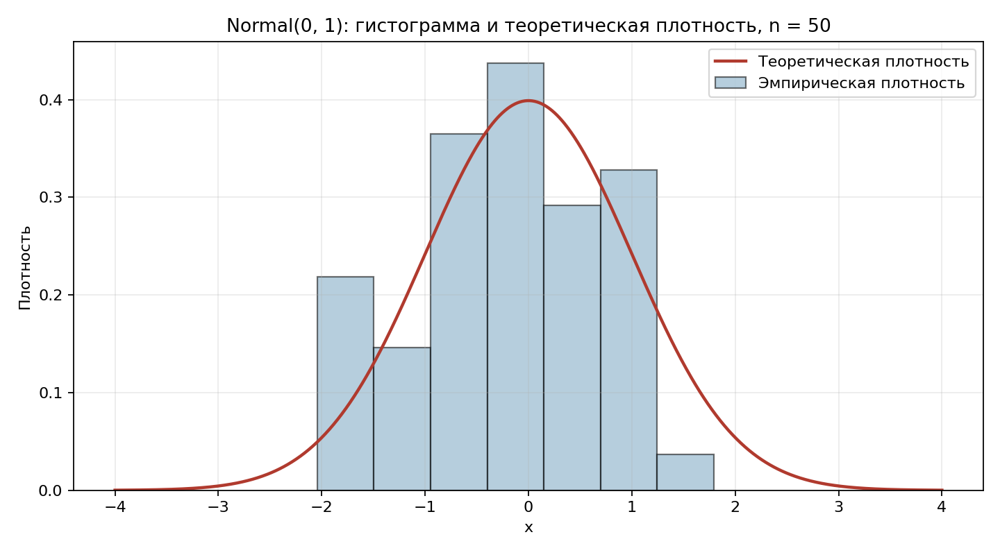
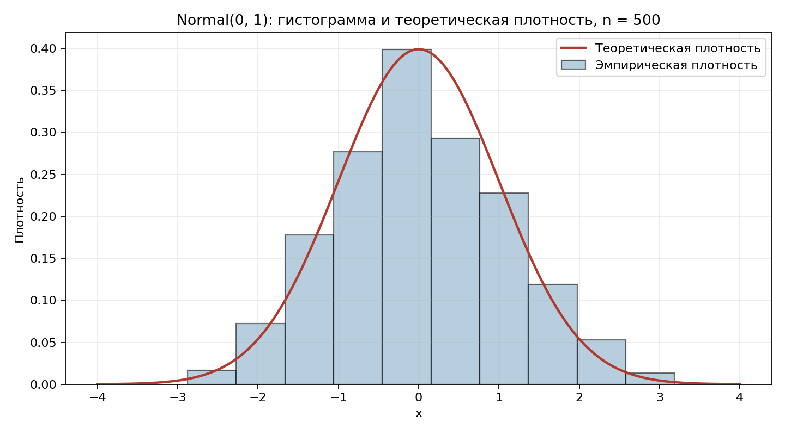
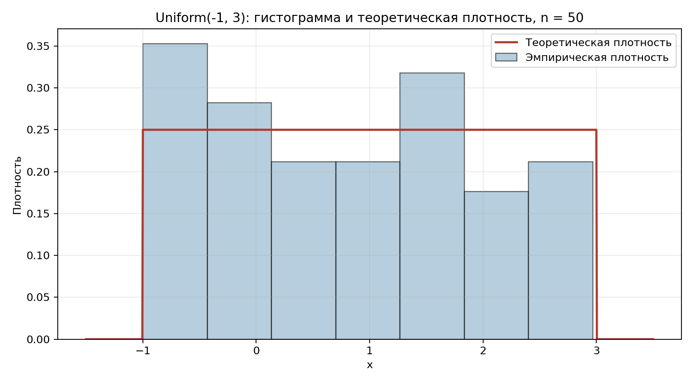
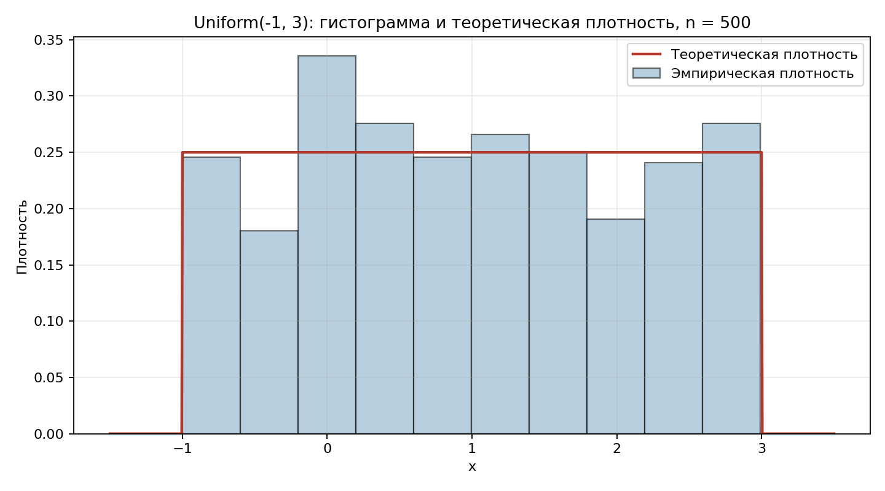
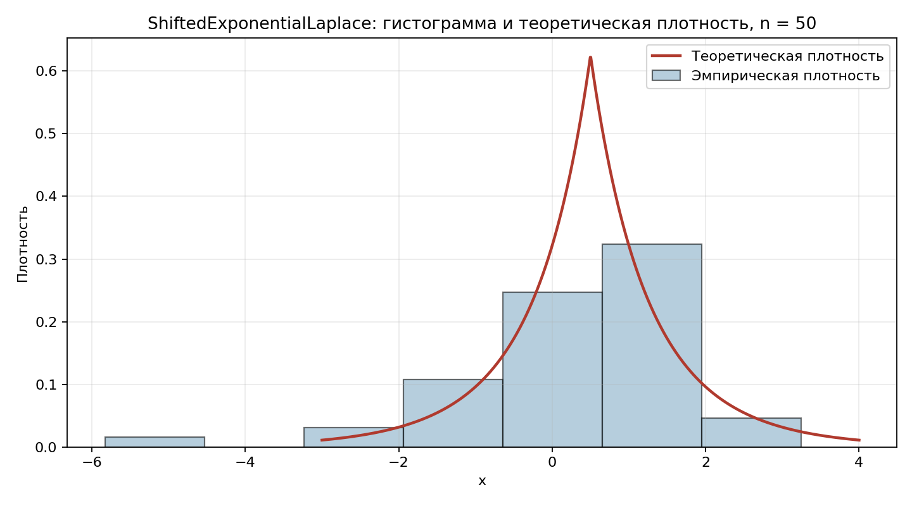
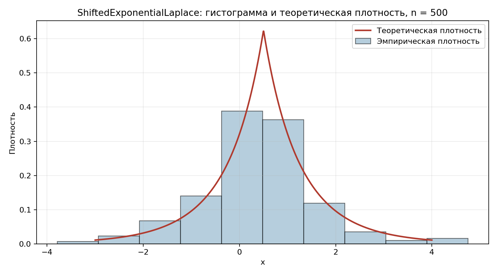

# Отчет по лабораторной работе

## 7.1 Постановка задачи

Требовалось разработать программу на C++, моделирующую выборки случайных величин с заданными распределениями, вычисляющую их основные числовые характеристики и сравнивающую эмпирические результаты с теоретическими значениями.

В проекте реализованы следующие распределения:

- нормальное распределение `Normal(0, 1)`;
- равномерное распределение `Uniform(-1, 3)`;
- сдвинутое экспоненциально-лапласовское распределение `ShiftedExponentialLaplace(shift = 0.5, scale = 1.2, form = 2.0)`.

Для каждого распределения программа:

- генерирует выборки объемов `50`, `500`, `5000`, `1000000`;
- вычисляет эмпирические оценки математического ожидания, дисперсии, асимметрии и эксцесса;
- сравнивает их с теоретическими характеристиками;
- строит эмпирическую плотность по гистограмме;
- сохраняет данные гистограмм в `.csv`;
- выводит значения теоретической и эмпирической плотности в контрольных точках.

Дополнительно в проекте продемонстрировано применение паттерна «Наблюдатель» для автоматического обновления гистограмм при изменении выборки.

## 7.2 Алгоритм, описание и текст разработанной программы

### Структура программы

Основная программа находится в файле `main.cpp`.

В ней используются следующие сущности:

- `IDistribution` задает общий интерфейс распределения: `density`, `randNum`, `mean`, `dispersion`, `asymmetry`, `excess`;
- `IPersistent` задает интерфейс сохранения и загрузки параметров;
- `Normal`, `Uniform`, `ShiftedExponentialLaplace` реализуют конкретные распределения;
- `Data` хранит выборку и вычисляет эмпирические характеристики;
- `Histogram` строит гистограмму и эмпирическую плотность;
- `IObserver` и связка `Data`/`Histogram` реализуют паттерн «Наблюдатель».

Для построения графиков используется файл `plot_density_hist.py`. Скрипт не генерирует выборку заново, а читает готовые данные гистограмм из `.csv` файлов и строит совмещенные графики эмпирической и теоретической плотности.

### Алгоритм работы программы

1. Создаются объекты трех распределений с фиксированными параметрами и зерном генератора `42`.
2. Для каждого распределения генерируются выборки объемов `50`, `500`, `5000`, `1000000`.
3. Для каждой выборки вычисляются:
   - эмпирическое математическое ожидание;
   - эмпирическая дисперсия;
   - эмпирическая асимметрия;
   - эмпирический эксцесс.
4. Полученные значения сравниваются с теоретическими характеристиками распределения.
5. Для выборок, меньших `1000`, строится гистограмма и сохраняются данные в `.csv`.
6. Число интервалов гистограммы выбирается по правилу Стерджеса:

```text
k = ceil(1 + log2(n))
```

7. Для каждой гистограммы в `.csv` сохраняются столбцы:

```text
bin_left,bin_right,emp_density
```

8. Скрипт `plot_density_hist.py` считывает эти `.csv` файлы и строит графики для выборок `n = 50` и `n = 500`.

### Формулы эмпирических характеристик

Для выборки `x_1, x_2, ..., x_n` используются формулы:

- математическое ожидание:

```text
m = (1 / n) * sum(x_i)
```

- дисперсия:

```text
D = (1 / n) * sum((x_i - m)^2)
```

- асимметрия:

```text
A = (1 / (n * D^(3/2))) * sum((x_i - m)^3)
```

- эксцесс:

```text
E = (1 / (n * D^2)) * sum((x_i - m)^4) - 3
```

### Краткое описание реализации распределений

`Normal`:

- плотность вычисляется по стандартной формуле нормального распределения;
- случайные значения генерируются через `std::normal_distribution`.

`Uniform`:

- плотность постоянна на отрезке `[a, b]` и равна `1 / (b - a)`;
- случайные значения генерируются через `std::uniform_real_distribution`.

`ShiftedExponentialLaplace`:

- плотность задается через базовую функцию `BaseDensity`;
- случайные значения моделируются с использованием двух экспоненциальных распределений и распределения Бернулли;
- вычисление характеристик использует численную аппроксимацию экспоненциального интеграла `E1(x)`.

### Текст программы

Текст разработанной программы представлен в файлах:

- `main.cpp`;
- `plot_density_hist.py`.

## 7.3 Результаты вычислений

Ниже приведены результаты, полученные при актуальном запуске программы.

### Нормальное распределение `Normal(0, 1)`

| Объем выборки | Эмпирическое M | Теоретическое M | Эмпирическая D | Теоретическая D | Эмп. асимм. | Теор. асимм. | Эмп. эксцесс | Теор. эксцесс |
|---|---:|---:|---:|---:|---:|---:|---:|---:|
| 50 | -0.220302 | 0.000000 | 0.855385 | 1.000000 | -0.214612 | 0.000000 | -0.663140 | 0.000000 |
| 500 | 0.022017 | 0.000000 | 1.147327 | 1.000000 | 0.101200 | 0.000000 | -0.222507 | 0.000000 |
| 5000 | 0.004088 | 0.000000 | 0.977983 | 1.000000 | -0.036966 | 0.000000 | -0.048446 | 0.000000 |
| 1000000 | 0.000624 | 0.000000 | 1.001804 | 1.000000 | 0.002659 | 0.000000 | 0.000019 | 0.000000 |

### Равномерное распределение `Uniform(-1, 3)`

| Объем выборки | Эмпирическое M | Теоретическое M | Эмпирическая D | Теоретическая D | Эмп. асимм. | Теор. асимм. | Эмп. эксцесс | Теор. эксцесс |
|---|---:|---:|---:|---:|---:|---:|---:|---:|
| 50 | 0.793674 | 1.000000 | 1.471501 | 1.333333 | 0.126550 | 0.000000 | -1.125192 | -1.200000 |
| 500 | 1.000218 | 1.000000 | 1.296148 | 1.333333 | 0.073798 | 0.000000 | -1.142686 | -1.200000 |
| 5000 | 0.999433 | 1.000000 | 1.316038 | 1.333333 | -0.027745 | 0.000000 | -1.185654 | -1.200000 |
| 1000000 | 1.000081 | 1.000000 | 1.332820 | 1.333333 | -0.000398 | 0.000000 | -1.198906 | -1.200000 |

### Сдвинутое экспоненциально-лапласовское распределение

Параметры: `shift = 0.5`, `scale = 1.2`, `form = 2.0`.

| Объем выборки | Эмпирическое M | Теоретическое M | Эмпирическая D | Теоретическая D | Эмп. асимм. | Теор. асимм. | Эмп. эксцесс | Теор. эксцесс |
|---|---:|---:|---:|---:|---:|---:|---:|---:|
| 50 | 0.307069 | 0.500000 | 2.270417 | 1.597494 | -1.560708 | 0.000000 | 4.291594 | 4.211293 |
| 500 | 0.393882 | 0.500000 | 1.347420 | 1.597494 | 0.172919 | 0.000000 | 1.802618 | 4.211293 |
| 5000 | 0.510895 | 0.500000 | 1.574571 | 1.597494 | 0.097889 | 0.000000 | 4.421497 | 4.211293 |
| 1000000 | 0.498693 | 0.500000 | 1.599367 | 1.597494 | -0.017449 | 0.000000 | 4.176370 | 4.211293 |

### Сравнение теоретической и эмпирической плотности

#### `Normal(0, 1)`, `n = 50`

| x | Теоретическая плотность | Эмпирическая плотность |
|---|---:|---:|
| -2.0 | 0.053991 | 0.218824 |
| -1.0 | 0.241971 | 0.145883 |
| 0.0 | 0.398942 | 0.437648 |
| 1.0 | 0.241971 | 0.328236 |
| 2.0 | 0.053991 | 0.000000 |

#### `Normal(0, 1)`, `n = 500`

| x | Теоретическая плотность | Эмпирическая плотность |
|---|---:|---:|
| -2.0 | 0.053991 | 0.072530 |
| -1.0 | 0.241971 | 0.276931 |
| 0.0 | 0.398942 | 0.398913 |
| 1.0 | 0.241971 | 0.227479 |
| 2.0 | 0.053991 | 0.052749 |

#### `Uniform(-1, 3)`, `n = 50`

| x | Теоретическая плотность | Эмпирическая плотность |
|---|---:|---:|
| -1.0 | 0.250000 | 0.000000 |
| 0.0 | 0.250000 | 0.282420 |
| 1.0 | 0.250000 | 0.211815 |
| 2.0 | 0.250000 | 0.176512 |
| 3.0 | 0.250000 | 0.000000 |

#### `Uniform(-1, 3)`, `n = 500`

| x | Теоретическая плотность | Эмпирическая плотность |
|---|---:|---:|
| -1.0 | 0.250000 | 0.000000 |
| 0.0 | 0.250000 | 0.335934 |
| 1.0 | 0.250000 | 0.265739 |
| 2.0 | 0.250000 | 0.190530 |
| 3.0 | 0.250000 | 0.000000 |

#### `ShiftedExponentialLaplace(shift = 0.5, scale = 1.2, form = 2.0)`, `n = 50`

| x | Теоретическая плотность | Эмпирическая плотность |
|---|---:|---:|
| -1.0 | 0.096067 | 0.107961 |
| 0.0 | 0.321390 | 0.246768 |
| 0.5 | 0.625000 | 0.246768 |
| 1.0 | 0.321390 | 0.323883 |
| 2.0 | 0.096067 | 0.046269 |

#### `ShiftedExponentialLaplace(shift = 0.5, scale = 1.2, form = 2.0)`, `n = 500`

| x | Теоретическая плотность | Эмпирическая плотность |
|---|---:|---:|
| -1.0 | 0.096067 | 0.140413 |
| 0.0 | 0.321390 | 0.388475 |
| 0.5 | 0.625000 | 0.362733 |
| 1.0 | 0.321390 | 0.362733 |
| 2.0 | 0.096067 | 0.119351 |

### Демонстрация паттерна «Наблюдатель»

Для выборки из 100 значений нормального распределения были построены три гистограммы с различным числом интервалов.

Результаты для точки `x = 2.5`:

- начальные значения: `h1 = 0.042674`, `h2 = 0.034139`, `h3 = 0.051209`;
- после изменения трех элементов выборки: `h1 = 0.042674`, `h2 = 0.046773`, `h3 = 0.046773`;
- после ручного уведомления: `h1 = 0.038977`.

Это подтверждает корректность автоматического и ручного обновления наблюдателей.

## 7.4 Графики плотностей и гистограммы

Для построения совмещенных графиков в проекте используется скрипт `plot_density_hist.py`.

Актуальная версия скрипта:

- читает данные гистограмм из `.csv` файлов;
- использует столбцы `bin_left`, `bin_right`, `emp_density`;
- строит графики для выборок `n = 50` и `n = 500`;
- сохраняет изображения в папку `plots`.

Сформированные файлы:

- `plots/normal_hist_50.png`;
- `plots/normal_hist_500.png`;
- `plots/uniform_hist_50.png`;
- `plots/uniform_hist_500.png`;
- `plots/sel_hist_50.png`;
- `plots/sel_hist_500.png`.

### Нормальное распределение

`n = 50`



`n = 500`



### Равномерное распределение

`n = 50`



`n = 500`



### Сдвинутое экспоненциально-лапласовское распределение

`n = 50`



`n = 500`



Пример запуска:

```powershell
$env:PATH='C:\msys64\ucrt64\bin;' + $env:PATH
python plot_density_hist.py
```

Если команда `python` недоступна, можно использовать:

```powershell
py plot_density_hist.py
```

## 7.5 Выводы

В ходе работы была разработана объектно-ориентированная программа для моделирования случайных величин и анализа их статистических характеристик.

По результатам вычислений можно сделать следующие выводы:

- при увеличении объема выборки эмпирические оценки математического ожидания, дисперсии, асимметрии и эксцесса приближаются к теоретическим значениям;
- для малых выборок отклонения заметно больше, особенно для асимметрии и эксцесса;
- использование правила Стерджеса позволяет автоматически выбирать разумное число интервалов гистограммы в зависимости от объема выборки;
- сохранение гистограмм в `.csv` и последующее построение графиков в Python делает визуализацию воспроизводимой и удобной для включения в отчет;
- для сдвинутого экспоненциально-лапласовского распределения на малых выборках наблюдаются наибольшие отклонения эмпирических характеристик от теоретических;
- паттерн «Наблюдатель» корректно обеспечивает автоматическое обновление производных объектов при изменении исходных данных.

Таким образом, поставленная задача решена, а полученные результаты согласуются с теорией вероятностей и математической статистикой.
